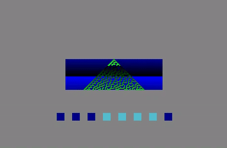

# cellular-automata-showcase-gba

  

A curated showcase of elementary cellular automata implemented on the Game Boy Advance using Mode 3. 

## Features

- A selection of Wolfram's 1D cellular automata rules (30, 90, 94, 109, 110, 150)
- Rule visualization as an abstract 8-bit coloured square representation
- Hardware fades via GBA blending registers
- Button navigation

## Technical Notes

- Each rule is handled by explicitly evaluating the 8 possible three-cell neighborhood configurations
- Rule numbers go from decimal to binary for visual representation purposes
- Automata states are precomputed before entering the gameloop and stored as "snapshots"
- Fade transitions utilize REG_BLDCNT and REG_BLDY hardware registers 
